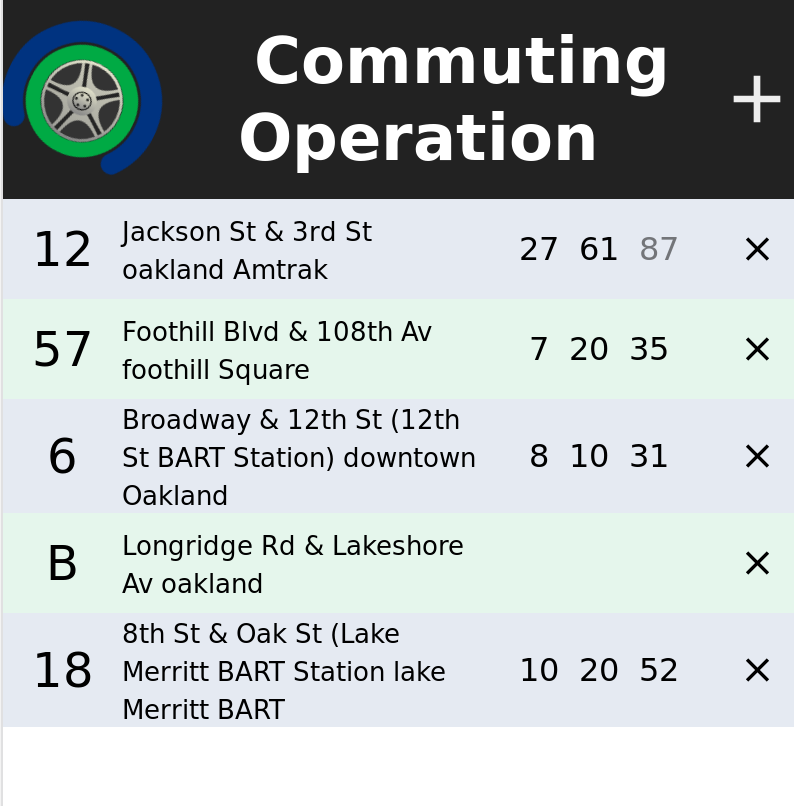

# Commuting Operation

I take the bus a lot, and none of the real-time arrival information applications
that I have seen did what I wanted.

This is my own webapp for real-time bus arrival information,
taking into account your preferred lines, your location, and the time-of-day.
Try it out [here](https://ian-r-rose.github.io/commuting-operation).

The name "Commuting Operation" is a pun on a mathematical concept
describing operations for which the order of application can
be swapped without changing the result.

## Usage

Click the `+` button to add a new line.
Select your transit agency, bus route, inbound direction,
outbound direction, and the time at which to change directions. 
The application will show you the nearest bus stop on that route.
It will show predictions for buses running in the inbound direction
*before* the change time, and it will show predictions for buses running
in the outbound direction *after* the change time.
The intended user is somebody who commutes on the bus, and uses
the same few routes on most days, but may not always be waiting at the
exact same stops.

## Code

This uses the [NextBus](https://www.nextbus.com/xmlFeedDocs/NextBusXMLFeed.pdf) API
for realtime arrival information. The user interface is written in React.
There is a small proxy running on Heroku for redirecting requests to NextBus.
